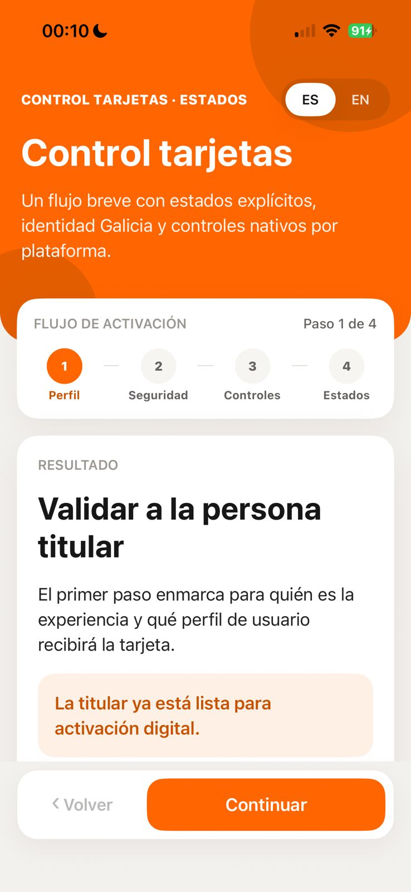
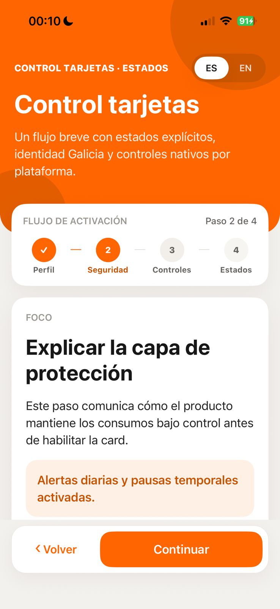
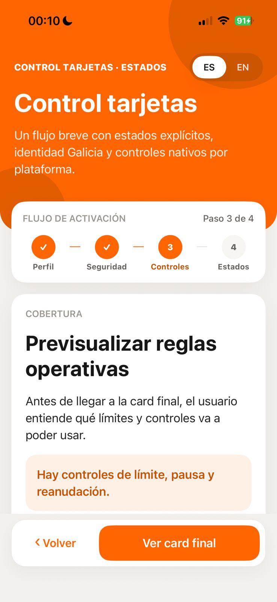
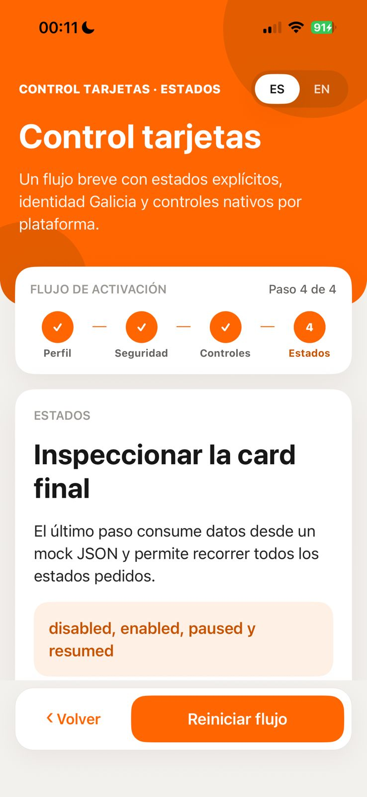
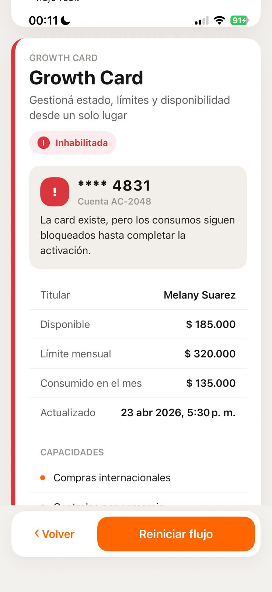
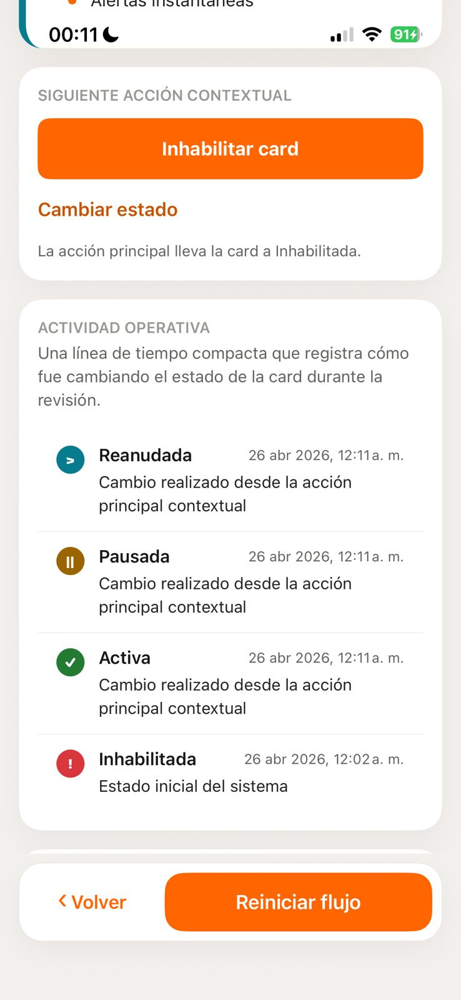

# Galicia Card Stepper

Aplicación mobile desarrollada como challenge técnico con React Native CLI.

La app permite recorrer un flujo informativo de 4 pasos y finaliza en una card operativa con estados explícitos: `disabled`, `enabled`, `paused` y `resumed` (despausada). El objetivo fue construir una app chica, pero pensada como una feature real: simple de levantar, clara de revisar y con decisiones técnicas defendibles.

## Demo

[Ver video demo](./assets/readme/demo.mp4)

<p>
  
  
  
  
</p>

<p>
  
  
</p>

## Requirement Coverage

| Requirement                                            | Implemented                                     |
| ------------------------------------------------------ | ----------------------------------------------- |
| Flujo tipo stepper informativo multi-step > 2          | Sí, flujo de 4 pasos                            |
| Card en el step final                                  | Sí, `StatusCard` en el último paso              |
| Estados inhabilitado, habilitado, pausado y despausado | Sí, `disabled`, `enabled`, `paused`, `resumed`  |
| Context para manejar el render del stepper             | Sí, `StepperProvider` + reducer                 |
| Mock JSON para datos visualizados en la card           | Sí, `StatusCard.mock.json`                      |
| Internacionalización                                   | Sí, `react-i18next` con ES/EN                   |
| StyleSheet                                             | Sí, estilos con `StyleSheet.create`             |
| Lógica de navegación y cambio de estados               | Sí, reducer del stepper + state machine de card |
| README con setup y decisiones técnicas                 | Sí, este documento                              |

## Tech Stack

- React Native CLI
- TypeScript
- Context API + reducer
- `react-i18next`
- `StyleSheet.create`
- Mock JSON local
- Jest + React Native Testing Library
- GitHub Actions
- Yarn como package manager

## Getting Started

### Requirements

- Node.js 22.x
- Yarn 1.x
- Xcode para iOS
- Android Studio para Android
- CocoaPods para instalar pods iOS

### About Yarn and Corepack

El proyecto usa Yarn. Si ya tenés Yarn instalado, podés ir directo a `yarn install`.

`corepack` no reemplaza a Yarn. Es una herramienta incluida en versiones modernas de Node.js que permite habilitar package managers como Yarn sin instalarlos globalmente a mano.

### Install dependencies

```bash
yarn install
```

Si tu terminal no reconoce `yarn`, ejecutá una vez:

```bash
corepack enable
```

### iOS

```bash
bundle install
cd ios
bundle exec pod install
cd ..
yarn ios
```

> iOS signing: el Development Team se configura localmente desde Xcode. No queda versionado para evitar acoplar el repo a una cuenta personal.

### Android

```bash
yarn android
```

### Metro

```bash
yarn start
```

## Project Structure

```txt
src/
  app/
    AppRoot/
  components/
    ActivityTimeline/
    LanguageToggle/
    ProgressStepper/
    StatusCard/
      StatusCard.tsx
      StatusCard.model.ts
      StatusCard.styles.ts
      StatusCard.types.ts
      StatusCard.mock.json
      StatusCardStateControls.ios.tsx
      StatusCardStateControls.android.tsx
  context/
    StepperContext/
      StepperContext.tsx
      stepperReducer.ts
      stepDefinitions.ts
  design-system/
    colors.ts
    fonts.ts
    radius.ts
    shadows.ts
    spacing.ts
  i18n/
    locales/
  screens/
    HomeScreen/
  utils/
```

La estructura busca que una app chica se lea como una feature real: componentes con styles/tests co-localizados, tipos cerca del módulo que los usa, design tokens separados y lógica de dominio cerca del feature owner.

## Architecture Decisions

### Context API

El stepper usa Context + reducer porque el estado compartido es chico, lineal y propio del flujo. Redux u otra librería global agregaría complejidad innecesaria para este scope.

### Navegación secuencial

No se usa React Navigation porque no hay múltiples pantallas reales ni deep stack. El flujo avanza solamente con `Continue` y `Back`; los indicadores del stepper son informativos y no navegan por tap para evitar saltos inválidos como `Paso 1 -> Paso 4`.

### Mock JSON

La card consume datos desde `src/components/StatusCard/StatusCard.mock.json`. Esto simula una fuente real sin introducir red, loading states artificiales o comportamiento no determinístico para el reviewer.

### i18n

La app inicia por defecto en español y permite cambiar a inglés con el toggle `ES / EN`. Los textos viven fuera de los componentes para separar UI copy de lógica y mantener paridad entre locales.

### StyleSheet

Los estilos usan `StyleSheet.create`, cumpliendo el requerimiento técnico y manteniendo un approach nativo, explícito y fácil de auditar.

### Platform-native UI

La identidad visual se inspira en Galicia, pero los controles se adaptan por plataforma con archivos `.ios.tsx` y `.android.tsx` cuando aporta valor. iOS usa interacciones más cercanas a ActionSheet; Android usa patrones más Material, ripple y superficies con radios/elevación más sobrios.

### Card State Logic

La card modela cada estado de forma explícita. Cada estado tiene label, ícono, color semántico, descripción y acción contextual para evitar que el naranja de marca sea la única señal visual.

## State Flow

```txt
Stepper:
Perfil -> Seguridad -> Controles -> Estados

Card:
disabled -> enabled -> paused -> resumed -> disabled
```

La timeline registra los cambios de estado para que la review pueda inspeccionar rápidamente que la lógica funciona y que los estados no son solo variantes visuales sueltas.

## Scripts

```bash
yarn check:package-manager
yarn format:check
yarn lint
yarn typecheck
yarn test
yarn test:coverage
yarn bundle:ios
yarn bundle:android
yarn android:assembleDebug
```

## Testing

La suite cubre comportamiento real con React Native Testing Library y unit tests donde corresponde:

- render inicial del flujo
- navegación secuencial del stepper
- bloqueo de saltos por stepper indicator
- reducer del stepper
- transiciones de estado de la card
- historial de cambios
- selectores de estado iOS y Android
- paridad de traducciones ES/EN
- formatters de moneda y fecha

Coverage actual:

```txt
Statements: 97%+
Branches:   84%+
Functions:  96%+
Lines:      97%+
```

GitHub Actions corre en pull requests y pushes a `main`: package manager check, format, lint, typecheck, coverage, bundles iOS/Android y Android debug build en `main`.

## Tradeoffs

- Context API fue elegido sobre Redux porque el dominio es chico y local.
- Mock JSON fue elegido sobre API remota porque el challenge evalúa UI state, arquitectura y criterio, no networking.
- `ScrollView` fue elegido sobre `FlatList` o `FlashList` porque la pantalla es corta, heterogénea y no necesita virtualización.
- No se agregó E2E con Detox/Maestro para no sobredimensionar el challenge, pero la arquitectura y CI dejan ese camino abierto.
- La UI usa una interpretación Galicia-inspired, no una copia literal de Banco Galicia.
- El video y los screenshots se incluyen como assets de README para que el reviewer pueda validar el resultado sin levantar la app primero.

## QA / QC

Validaciones usadas durante el desarrollo:

```bash
yarn check:package-manager
yarn format:check
yarn lint
yarn typecheck
yarn test:coverage
yarn bundle:ios
yarn bundle:android
yarn android:assembleDebug
```

Smoke manual:

- iOS simulator/device: flujo completo, safe areas, cambio ES/EN y estados de card.
- Android emulator/device: flujo completo, Material controls, ripple, footer y estados de card.

## Future Improvements

- Persistir progreso y último estado de la card.
- Agregar deep link de producto para abrir directo el último paso.
- Sumar E2E con Maestro o Detox si el flujo creciera.
- Conectar el mock JSON a una API o remote config.

## Author

Juan Carlos Videla

- GitHub: [jeyzee23](https://github.com/jeyzee23)
