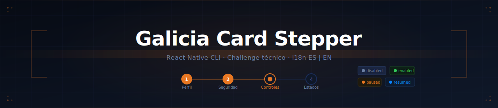
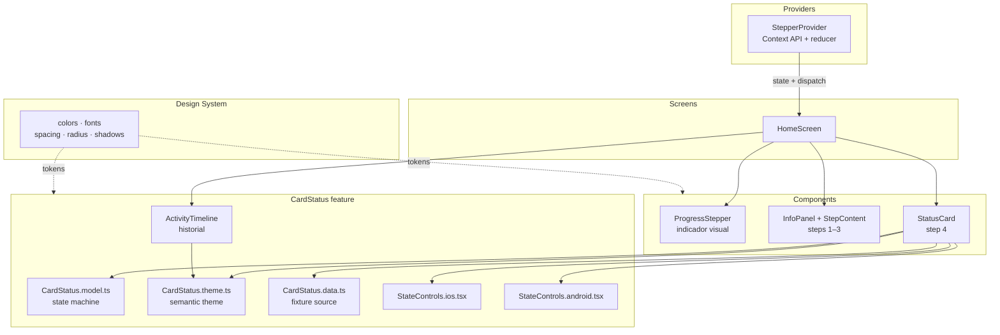
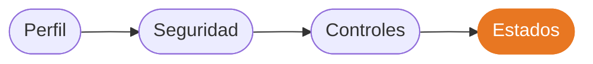
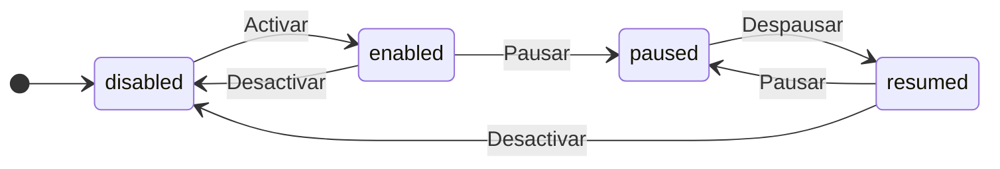

<div align="center">
  
</div>

<br/>

<div align="center">

[](https://github.com/jeyzee23/stepper-card-challenge/actions)
[](#testing)
[](https://www.typescriptlang.org/)
[](https://reactnative.dev/)
[](https://nodejs.org/)
[](#decisiones-de-arquitectura)

</div>

<br/>

Challenge técnico de React Native CLI. Flujo informativo de 4 pasos con internacionalización ES/EN y una card con máquina de estados explícita: `disabled → enabled → paused → resumed`.

El objetivo no fue solo cumplir los requisitos, sino construir una feature chica pensada como si fuera a producción: simple de levantar, fácil de auditar y con decisiones técnicas que se puedan defender.

> [!NOTE]
>
> **Tiempo estimado de review: ~10 minutos.** La sección [Guía para el reviewer](#guía-para-el-reviewer) indica exactamente qué archivos mirar primero.

---

## Tabla de contenidos

- [Demo](#demo)
- [Guía para el reviewer](#guía-para-el-reviewer)
- [Cobertura de requisitos](#cobertura-de-requisitos)
- [Tech Stack](#tech-stack)
- [Setup](#setup)
- [Estructura del proyecto](#estructura-del-proyecto)
- [Arquitectura de componentes](#arquitectura-de-componentes)
- [Flujo de estados](#flujo-de-estados)
- [Decisiones de arquitectura](#decisiones-de-arquitectura)
- [Engineering Notes](#engineering-notes)
- [Testing](#testing)
- [CI / Quality Gates](#ci--quality-gates)
- [Scripts disponibles](#scripts-disponibles)
- [Tradeoffs](#tradeoffs)
- [Fuera de scope](#fuera-de-scope)
- [Mejoras futuras](#mejoras-futuras)
- [Autor](#autor)

---

## Demo

https://github.com/user-attachments/assets/dc9545d6-730b-4347-a55b-bbc3f27d3536

<div align="center">

<table>
  <tr>
    <td align="center"><strong>Step 1 — Perfil</strong></td>
    <td align="center"><strong>Step 2 — Seguridad</strong></td>
    <td align="center"><strong>Step 3 — Controles</strong></td>
    <td align="center"><strong>Step 4 — Estados</strong></td>
  </tr>
  <tr>
    <td></td>
    <td></td>
    <td></td>
    <td></td>
  </tr>
</table>

<table>
  <tr>
    <td align="center"><strong>Card final con estados</strong></td>
  </tr>
  <tr>
    <td></td>
  </tr>
</table>

</div>

---

## Guía para el reviewer

> [!TIP]
> Si tenés **5 minutos**, estos son los archivos que concentran las decisiones más relevantes del challenge — en orden de lectura sugerido:

|  #  | Archivo                                                                   | Por qué importa                                                             |
| :-: | ------------------------------------------------------------------------- | --------------------------------------------------------------------------- |
|  1  | `src/context/StepperContext/stepperReducer.ts`                            | Transiciones explícitas del flujo. El corazón del stepper.                  |
|  2  | `src/features/CardStatus/CardStatus.model.ts`                             | Máquina de estados de la card. Lógica de dominio separada del render.       |
|  3  | `src/context/StepperContext/stepDefinitions.ts`                           | Configuración declarativa de pasos. Muestra cómo escalaría el flujo.        |
|  4  | `src/features/CardStatus/StatusCard/controls/StatusCardStateControls.tsx` | Entry point explícito para resolver split iOS/Android sin magia de tooling. |
|  5  | `src/app/AppRoot/ErrorBoundary/ErrorBoundary.tsx`                         | Fallback controlado ante errores inesperados del flujo.                     |
|  6  | `src/design-system/`                                                      | Design tokens centralizados en lugar de valores hardcodeados.               |
|  7  | `src/i18n/locales/`                                                       | Paridad ES/EN. Los tests validan que no se rompa.                           |
|  8  | `.github/workflows/quality.yml`                                           | Qué se protege en cada push y por qué.                                      |

**Criterio de diseño clave:** la card no depende del stepper — su estado es independiente y puede montarse aislada. El stepper no sabe que existe la card. Esa separación fue intencional.

---

## Cobertura de requisitos

| Requisito                                              | Estado | Detalle                                                                  |
| ------------------------------------------------------ | :----: | ------------------------------------------------------------------------ |
| Flujo tipo stepper informativo (más de 2 pasos)        |   ✅   | 4 pasos: Perfil, Seguridad, Controles, Estados                           |
| Card en el step final                                  |   ✅   | `StatusCard` montada solo en el último paso                              |
| Estados: inhabilitado, habilitado, pausado, despausado |   ✅   | `disabled`, `enabled`, `paused`, `resumed`                               |
| Context para manejar el render del stepper             |   ✅   | `StepperProvider` + `stepperReducer`                                     |
| Mock JSON para datos visualizados en la card           |   ✅   | `src/features/CardStatus/CardStatus.mock.json`                           |
| Internacionalización                                   |   ✅   | `react-i18next` con soporte ES / EN                                      |
| StyleSheet nativo                                      |   ✅   | `StyleSheet.create` en todos los componentes                             |
| Lógica de navegación y cambio de estados               |   ✅   | Reducer del stepper + revisit de pasos visitados + state machine de card |
| README con setup y decisiones técnicas                 |   ✅   | Este documento                                                           |

---

## Tech Stack

| Área                 | Herramienta                         | Versión         |
| -------------------- | ----------------------------------- | --------------- |
| Runtime mobile       | React Native CLI                    | `0.85.2`        |
| UI runtime           | React                               | `19.2.3`        |
| Lenguaje             | TypeScript                          | `5.8.x`         |
| Estado               | Context API + reducer               | —               |
| Internacionalización | i18next + react-i18next             | `26.x` / `17.x` |
| Estilos              | React Native StyleSheet             | —               |
| Testing              | Jest + React Native Testing Library | `29.x` / `13.x` |
| Calidad              | ESLint + Prettier                   | `8.x` / `2.8.x` |
| CI                   | GitHub Actions                      | —               |
| Package manager      | Yarn                                | `1.x`           |

---

## Setup

### Requisitos previos

- Node.js `22.x`
- Yarn `1.x`
- Xcode (para iOS)
- Android Studio (para Android)
- CocoaPods (para pods iOS)

> [!NOTE]
>
> **Sobre Yarn y Corepack:** si tu terminal no reconoce `yarn`, ejecutá `corepack enable` una sola vez. Corepack viene incluido en Node.js moderno y activa Yarn sin instalación global manual.

### Instalar dependencias

```bash
yarn install
```

### iOS

```bash
bundle install
cd ios && bundle exec pod install && cd ..
yarn ios
```

> [!NOTE]
>
> **iOS signing:** el Development Team se configura localmente desde Xcode y no está versionado para evitar acoplar el repo a una cuenta personal.

### Android

```bash
yarn android
```

### Metro standalone

```bash
yarn start
```

---

## Estructura del proyecto

```
src/
├─ app/
│  └─ AppRoot/
│     ├─ ErrorBoundary/
│     │  ├─ ErrorBoundary.tsx                 # Fallback controlado del flujo
│     │  └─ ErrorBoundary.test.tsx
│     └─ AppRoot.tsx                          # Entry point de la app
│
├─ components/
│  ├─ InfoPanel/
│  ├─ LanguageToggle/                          # Toggle ES / EN
│  ├─ ProgressStepper/                         # Indicador de progreso visual
│  └─ QualitySignals/
│
├─ context/
│  └─ StepperContext/
│     ├─ StepperContext.tsx                    # Provider + hooks
│     ├─ stepperReducer.ts           ←         # Transiciones NEXT / PREVIOUS / RESET
│     └─ stepDefinitions.ts                    # Config declarativa de pasos
│
├─ features/
│  └─ CardStatus/
│     ├─ CardStatus.model.ts         ←         # State machine + helpers de historial
│     ├─ CardStatus.theme.ts                   # Semántica visual compartida
│     ├─ CardStatus.types.ts                   # Tipos de dominio
│     ├─ CardStatus.data.ts                    # Fixture default del challenge
│     ├─ CardStatus.mock.json                  # Datos mock de la card
│     ├─ ActivityTimeline/                     # Historial del feature
│     └─ StatusCard/
│        ├─ StatusCard.tsx                     # UI principal de la card
│        ├─ components/                        # Subcomponentes visuales
│        ├─ controls/                          # Split iOS / Android con intención real
│        └─ hooks/                             # Hooks internos del feature
│
├─ design-system/
│  ├─ colors.ts                               # Paleta semántica
│  ├─ fonts.ts
│  ├─ radius.ts
│  ├─ shadows.ts
│  └─ spacing.ts
│
├─ i18n/
│  ├─ locales/                                # Archivos de traducción ES / EN
│  ├─ i18nInstance.ts                         # Instancia aislada (evita require cycles)
│  └─ translate.ts                            # Helper para código no-hook
│
├─ screens/
│  └─ HomeScreen/
│     ├─ Header/
│     ├─ Footer/
│     ├─ Stepper/
│     └─ hooks/
│
└─ utils/
```

---

## Arquitectura de componentes



---

## Flujo de estados

### Stepper



### Card — State Machine



> [!TIP]
> La `ActivityTimeline` registra cada transición en tiempo real. Si querés validar que los estados no son solo variantes visuales sino cambios reales de lógica, mirá el historial mientras interactuás con los controles.

---

## Decisiones de arquitectura

### Context API

El stepper usa Context + reducer porque el estado compartido es chico, lineal y local al flujo. Redux u otra librería global agregaría boilerplate innecesario para este scope.

El reducer mantiene explícitas las transiciones `NEXT`, `PREVIOUS` y `RESET` — predecibles, testeables y fáciles de extender si en el futuro hubiera pasos condicionales o bifurcaciones.

Un siguiente paso natural si el árbol creciera sería separar `StepperStateContext` y `StepperDispatchContext` para reducir re-renders mediante selector pattern. Para 4 pasos y componentes livianos, el impacto práctico es nulo, así que se mantuvo una API única y simple.

### Sin React Navigation

No hay múltiples pantallas reales ni deep stack. El flujo avanza con `Continue` y `Back`. Los indicadores del stepper son informativos y no navegan por tap para prevenir saltos inválidos (ej: Paso 1 → Paso 4 directamente).

### Platform-native UI

Los controles se adaptan por plataforma con archivos `.ios.tsx` y `.android.tsx` cuando el split aporta valor real, no cosmético. iOS usa interacciones cercanas a ActionSheet; Android usa patrones Material con ripple y elevación más sobria. Si la diferencia fuera solo de color, no habría split.

Además, los módulos con split tienen un entry point base (`HomeScreenHeader.tsx`, `HomeScreenFooter.tsx`, `StatusCardStateControls.tsx`) para que Metro, Jest y TypeScript resuelvan exactamente lo mismo sin depender de heurísticas implícitas.

### Safe area ownership

`HomeScreen` es el único owner del layout de insets y del espacio reservado para el footer. Los subcomponentes (`Header`, `Footer`) reciben esos valores ya resueltos por props. Eso evita repartir la responsabilidad entre varios nodos del árbol y hace más predecible el comportamiento del scroll en iOS y Android.

### Mock JSON sobre API remota

La card consume datos desde `src/features/CardStatus/CardStatus.mock.json`, expuestos vía `CardStatus.data.ts`. Esto simula una fuente real sin introducir red, loading states artificiales ni comportamiento no determinístico para el reviewer.

### Estado semántico multicapa

Cada estado de la card tiene: label, ícono, color semántico, descripción, borde lateral coloreado y badge. El estado no depende únicamente del color — esto mejora la accesibilidad visual en una UI con naranja dominante y reduce ambigüedad de lectura.

---

## Engineering Notes

**Co-location philosophy:** lo visual compartido vive en `src/components/`. Lo específico del caso de uso vive dentro del feature (`src/features/CardStatus/ActivityTimeline`, `src/features/CardStatus/StatusCard`). Eso evita inflar `components/` con UI que en realidad pertenece a un solo flujo.

**Alias `@/` en imports:** evita rutas relativas largas (`../../../`). La resolución quedó centralizada para tooling JS en `config/moduleResolution.js` y reflejada en TS con `paths`, reduciendo drift entre Babel, Metro y Jest.

**Lógica de dominio separada del render:** `src/features/CardStatus/CardStatus.model.ts` contiene la state machine e historial. `StatusCard.tsx` solo compone y renderiza. Si mañana cambia el modelo de estados, el render no se toca.

**Ownership del dominio desacoplado de screens:** el hook `useCardStatusHistory` vive en `src/features/CardStatus/hooks/` y se consume desde `HomeScreen` vía API pública del feature. La screen orquesta layout y navegación; la feature mantiene su lógica de estado.

**Instancia de i18n aislada:** `i18nInstance.ts` está separado del barrel de `i18n` para evitar require cycles entre la instancia y los helpers. El helper `translate()` permite usar i18n fuera de componentes (reducers, models) sin violar las reglas de hooks.

**Tipado de idioma consistente:** `AppLanguage` se centraliza en `src/i18n/types.ts` y se normaliza desde `i18n.language` antes de llegar a helpers de dominio/formateo, evitando strings libres en rutas críticas.

**Formateadores `Intl` cacheados:** `formatCurrency` y `formatDateTime` reutilizan instancias de `Intl` por idioma/moneda para evitar recreación constante y mantener el costo de render más predecible.

**Design tokens centralizados:** ningún componente hardcodea colores, espaciados o radios. Todo referencia `src/design-system/`. Si el brand cambia, cambia en un solo lugar.

**React Native New Architecture:** se mantiene activa (`newArchEnabled=true` en Android y pods Fabric en iOS) porque es el default esperado para React Native `0.85` + React `19`. No se deshabilitó ya que la app no introduce native modules custom que requieran fallback legacy.

---

## Testing

La suite cubre comportamiento real con **React Native Testing Library** y unit tests donde corresponde. No hay tests de implementación — se testea qué hace el componente, no cómo lo hace internamente.

| Caso cubierto                                  | Tipo        |
| ---------------------------------------------- | ----------- |
| Render inicial del flujo completo              | Integration |
| Navegación secuencial NEXT / PREVIOUS          | Integration |
| Bloqueo de saltos por tap en stepper indicator | Integration |
| Reducer del stepper — todas las transiciones   | Unit        |
| Transiciones de estado de la card              | Unit        |
| Historial de cambios (ActivityTimeline)        | Unit        |
| Selectores de estado iOS y Android             | Unit        |
| Error Boundary del app shell                   | Unit        |
| Paridad de traducciones ES / EN                | Unit        |
| Formatters de moneda y fecha                   | Unit        |

### Coverage actual

| Métrica    | Resultado |
| ---------- | --------- |
| Statements | `97%+`    |
| Branches   | `84%+`    |
| Functions  | `96%+`    |
| Lines      | `97%+`    |

```bash
yarn test
yarn test:coverage
```

---

## CI / Quality Gates

GitHub Actions corre en pull requests y pushes a `main`. Cada check protege una capa distinta:

| Check                   | Qué protege                                        |
| ----------------------- | -------------------------------------------------- |
| `check:package-manager` | Evita mezclar npm / yarn en el mismo proyecto      |
| `format:check`          | Formato consistente sin discusiones de estilo      |
| `lint`                  | Imports, reglas Jest y código no usado             |
| `typecheck`             | TypeScript sin emitir build — rápido y explícito   |
| `test:coverage`         | Comportamiento real + umbrales mínimos de coverage |
| `bundle:ios`            | Que Metro pueda empaquetar iOS sin errores         |
| `bundle:android`        | Que Metro pueda empaquetar Android sin errores     |
| `android:assembleDebug` | Build Android real en cada push a `main`           |

> [!NOTE]
> No se agrega build nativo iOS en CI porque requeriría runner macOS pago. Para el alcance del challenge, `bundle:ios` en CI + smoke manual en simulador cubre la señal necesaria sin sobredimensionar costos de pipeline.

---

## Scripts disponibles

```bash
# Calidad de código
yarn check:package-manager    # Valida que se use Yarn y no npm
yarn format:check             # Verifica formato con Prettier
yarn lint                     # ESLint completo sobre el proyecto
yarn typecheck                # TypeScript sin emit

# Tests
yarn test                     # Suite completa
yarn test:coverage            # Con informe de coverage por umbral

# Bundles y builds
yarn bundle:ios               # Bundle Metro para iOS
yarn bundle:android           # Bundle Metro para Android
yarn android:assembleDebug    # APK debug de Android
```

---

## Tradeoffs

| Decisión             | Alternativa descartada   | Razón                                                                    |
| -------------------- | ------------------------ | ------------------------------------------------------------------------ |
| Context API          | Redux / Zustand          | Estado chico y local al flujo del stepper                                |
| Mock JSON            | API remota / MSW         | El challenge evalúa UI state y criterio, no networking                   |
| `ScrollView`         | `FlatList` / `FlashList` | Pantalla corta, heterogénea, sin necesidad de virtualización             |
| Sin React Navigation | Stack navigator          | No hay stack real ni deep linking en el scope                            |
| Sin Detox / Maestro  | E2E completo             | Sobredimensionaría el challenge; la arquitectura deja ese camino abierto |
| UI Galicia-inspired  | Copia literal del brand  | Evita restricciones de IP y permite decisiones de diseño propias         |

---

## Fuera de scope

> [!IMPORTANT]
> Lo que sigue **no es deuda técnica** — es scope acotado de forma deliberada. Cada ítem tiene una ruta clara de implementación si el proyecto creciera.

- **Persistencia de estado:** el progreso del stepper y el último estado de la card no sobreviven un hot reload. Se resolvería con AsyncStorage o MMKV referenciado desde el model.
- **E2E:** no hay tests con Detox ni Maestro. La separación de lógica deja ese camino abierto sin refactors estructurales.
- **Accesibilidad completa:** los componentes usan `accessibilityLabel` básico pero no cubren `accessibilityRole`, `accessibilityState` ni VoiceOver/TalkBack exhaustivo.
- **Deep linking:** no hay React Navigation ni URL schemes configurados. El flujo arranca siempre desde el paso 1.
- **API real:** la card consume mock JSON local. Conectarla a una API o remote config es trivial dado que el model está desacoplado del componente.

---

## Mejoras futuras

- [ ] Persistir progreso del stepper y último estado de la card (AsyncStorage / MMKV).
- [ ] Deep link para abrir directo en el último paso (React Navigation + linking config).
- [ ] E2E con Maestro o Detox si el flujo creciera en pasos o bifurcaciones.
- [ ] Conectar el mock JSON a una API real o remote config / feature flags.
- [ ] Accesibilidad completa: `accessibilityRole`, `accessibilityState`, VoiceOver y TalkBack.
- [ ] Animaciones de transición entre pasos con Reanimated 3.

---

## Autor

**Juan Carlos Videla**
GitHub: [@jeyzee23](https://github.com/jeyzee23)
